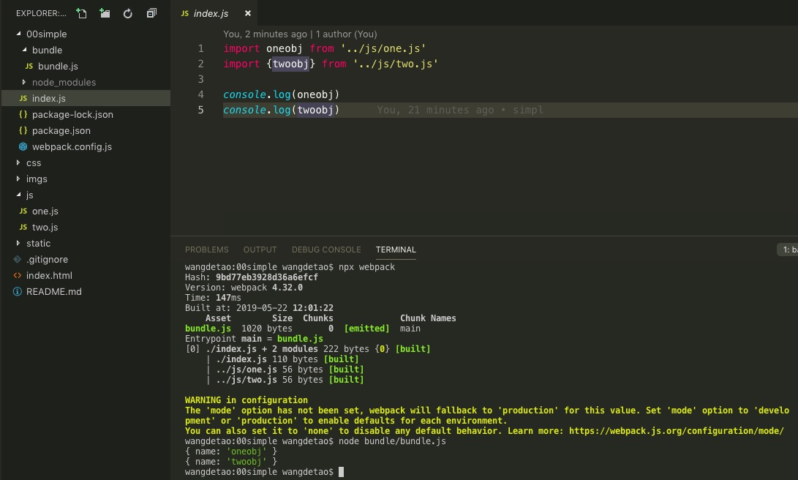
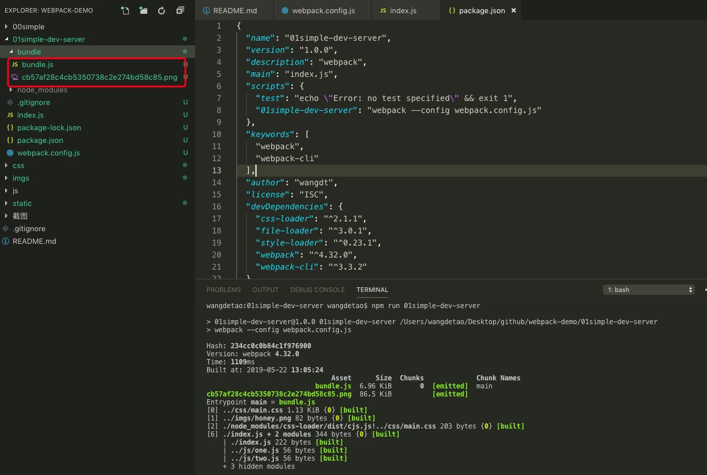
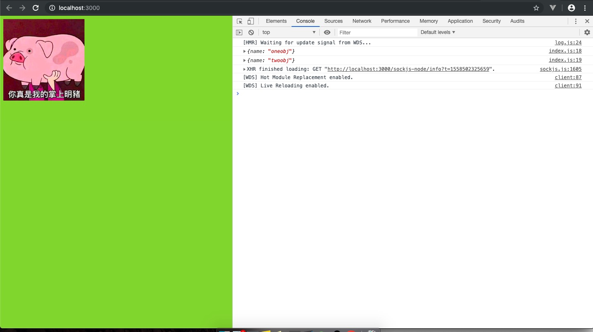
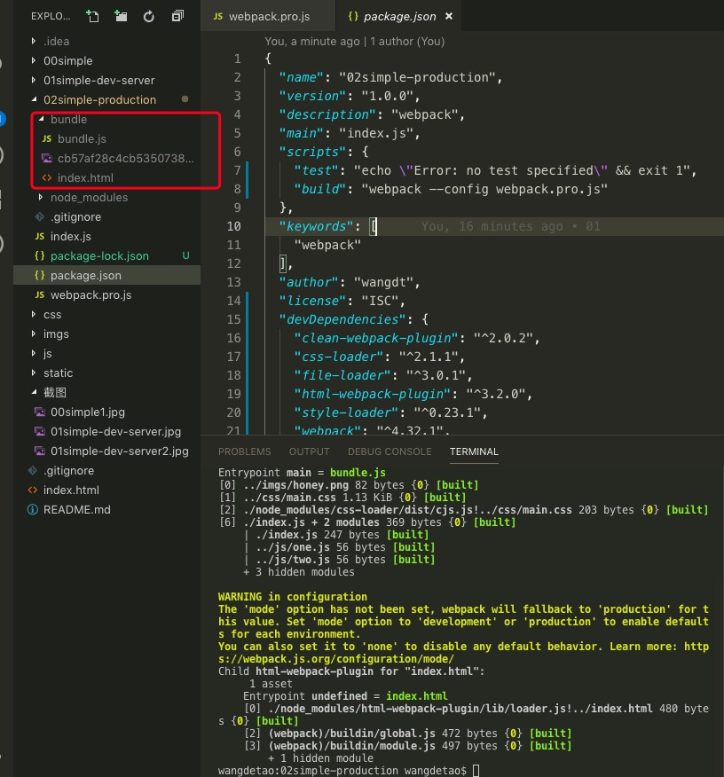

# webpack

webpack 是一个现代 JavaScript 应用程序的静态模块打包器(module bundler)。
接下来我们从0开始，一步一步实现我们的打包，作为入门，希望大家有所收获。

源码地址，欢饮Star[https://github.com/WangDeTao/webpack-simple-demo]

# 整体项目模块介绍
    - 00simple（只包含简单的js文件打包）
    - 01simple-dev-server（本地的服务，包含js，css，图片，html，增加loader,plugin,derServer）
    - 02simple-production（打包成生产环境静态资源）
    - css（css文件）
    - imgs(图片文件)
    - js(js文件one.js/two.js)
    - static(viewport.js,在index.html引入)

# 00simple介绍
首先用npm init 来初始化管理我们的项目，接着安装webpack和webpack-cli；
```
npm init -y
npm install -D webpack webpack-cli
```
安装完成以后，创建webpack.config.js文件，配置好入口和出口;

<font color=red>注意：</font> 出口需要指定文件名和路径，其中__dirname 表示当前文件所在目录的完整目录名  
```
const path = require('path')
module.exports = {
    entry:'./index.js',
    output:{
        filename:'bundle.js',
        path:path.resolve(__dirname,'./bundle')
    }
}
```
执行打包命令npx webpack就可以看到如下图生成了bundle文件夹，执行node bundle/bundle.js 会看到输出了index.js里面到处的对象

<font color=red>注意：</font>  npx 会帮你执行依赖包里的二进制文件。 


但是更多的时候我们是希望通过'npm run xxx'的形式来打包，这个时候也很简单，只需要在package.json的script下面添加
```
"scripts": {
    "00simple": "webpack --config webpack.config.js"
  }
```
接着在terminal输入'npm run 00simple'即可,run是run-script的简写。

# 01simple-dev-server介绍
这一章节我们将会增加loader，plugin和devServer的内容。

## loader和plugin的区别
- loader 用于对模块的源代码进行转换，比如es6/7转es3，less/sass转css等
- plugin 用于扩展webpack的功能，比如压缩混淆，整合html和js，复制文件等

## 本章节的loader和plugin
- style-loader/css-loader 处理css
- file-loader   处理图片
- html-webpack-plugin 整合html和打包的js文件

首先安装上述提到的loader
```
npm install -D style-loader css-loader file-loader
```
同时在webpack.config.js增加module 并且 在index.js引入css和图片，并将图片添加到html中。
```
    module:{
        rules:[
            {test:/\.css$/,use:['style-loader','css-loader']},
            {test:/\.(png|jpg|gif)$/,use:['file-loader']}
        ]
    }
```
```
import  '../css/main.css'
import honey from'../imgs/honey.png'

let img = new Image();
img.src = honey;
document.body.appendChild(img) //图片添加到页面
```
其中test表示匹配的正则，use使我们需要使用的loader。

接着在package.json增加 "01simple-dev-server": "webpack --config webpack.config.js"
执行 npm run 01simple-dev-server，我们发现bundle下面多了一张图片，如下


那么怎么将html和打包的js结合起来呢？？？我想跑起来看一下啊，没有页面不直观啊。

好的，接下来我们安装 html-webpack-plugin插件，接着安装webpack-dev-server；
```
npm install -D html-webpack-plugin
npm install -D webpack-dev-server
```
接着创建一个html文件，并在webpack.config.js里面增加
```
const HtmlWebpackPlugin = require('html-webpack-plugin')


plugins:[
    new HtmlWebpackPlugin({
        filename:'index.html', //文件名
        template:'../index.html'//模板
    })
],
devServer:{
    hot:true,
    port:3000
}
```
在package.json里面增加一行命令，"dev": "webpack-dev-server --open --config webpack.config.js"

接着运行 npm run dev，见证奇迹的时候到了，我们的浏览器自动打开了


HtmlWebpackPlugin可以简单的理解为将我们打包好的js与我们的模板html整合一起

devServer帮助我们起一个本地的服务器，同时可以增加port端口等相关属性

本章节webpack.config.js完整代码如下
```
const path = require('path')
const HtmlWebpackPlugin = require('html-webpack-plugin')
module.exports = {
    entry:'./index.js',
    output:{
        filename:'bundle.js',
        path:path.resolve(__dirname,'bundle')
    },
    module:{
        rules:[
            {test:/\.css$/,use:['style-loader','css-loader']},
            {test:/\.(png|jpg|gif)$/,use:['file-loader']}
        ]
    },
    plugins:[
        new HtmlWebpackPlugin({
            filename:'index.html',
            template:'../index.html'
        })
    ],
    devServer:{
        hot:true,
        port:3000
    }
}
```
# 02simple-production介绍

生产环境的包我们会去掉提示，会压缩处理我们的代码，接下来我会多安装一个插件clean-webpack-plugin插件，可以帮助我们打包前先清除dist，当然你还可以自行安装诸如copy-webpack-plugin等插件
```
npm install -D clean-webpack-plugin
```
接下来看下我们的webpack.pro.js
```
const path = require('path')
const HtmlWebpackPlugin = require('html-webpack-plugin')
const CleanWebpackPlugin = require('clean-webpack-plugin')//清除bundle
module.exports = {
    entry:'./index.js',
    output:{
        filename:'bundle.js',
        path:path.resolve(__dirname,'bundle')
    },
    module:{
        rules:[
            {test:/\.css$/,use:['style-loader','css-loader']},
            {test:/\.(png|jpg|gif)$/,use:['file-loader']}
        ]
    },
    plugins:[
            new CleanWebpackPlugin(),
            new HtmlWebpackPlugin({
                filename:'index.html',
                template:'../index.html',//可指定模板，可省略
                inject:true,
                minify: { // 压缩HTML文件
                    removeComments: true, // 移除HTML中的注释
                    collapseWhitespace: true, // 删除空白符与换行符
                    minifyCSS: true// 压缩内联css
                }
            }),
    ]
}
```
增加了CleanWebpackPlugin插件 同时 对html进行压缩，移出注释等处理。

最后别忘了更改package.json里面的命令  "build": "webpack --config webpack.pro.js" ，执行 npm run build

在我们的文件夹下会生成一个bundle文件，大功告成。


总结：
通过上面的步骤，我们基本了解也实现了自己的打包。webpack中主要包含entry,output,module,plugin，当然还有mode,resolve,devServer等让我们进一步去了解，本篇作为入门，希望您有所收获。

源码地址，欢饮Star[https://github.com/WangDeTao/webpack-simple-demo]
